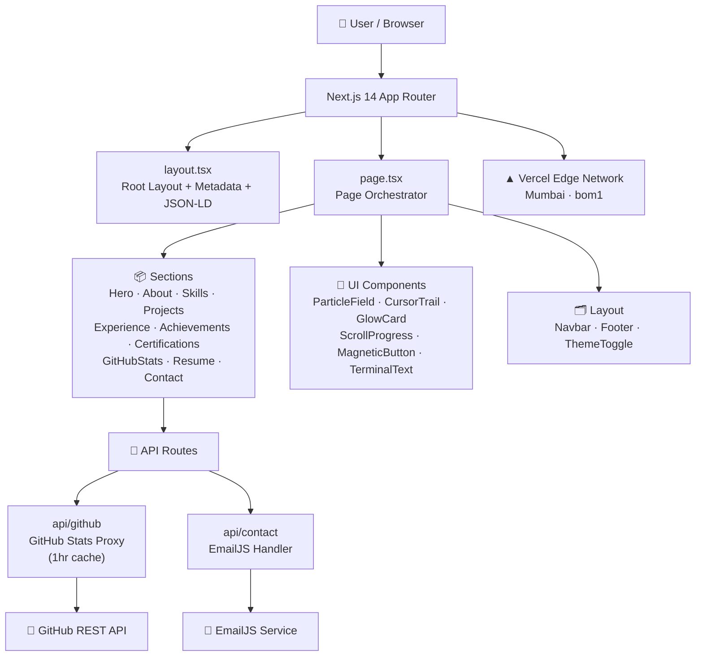
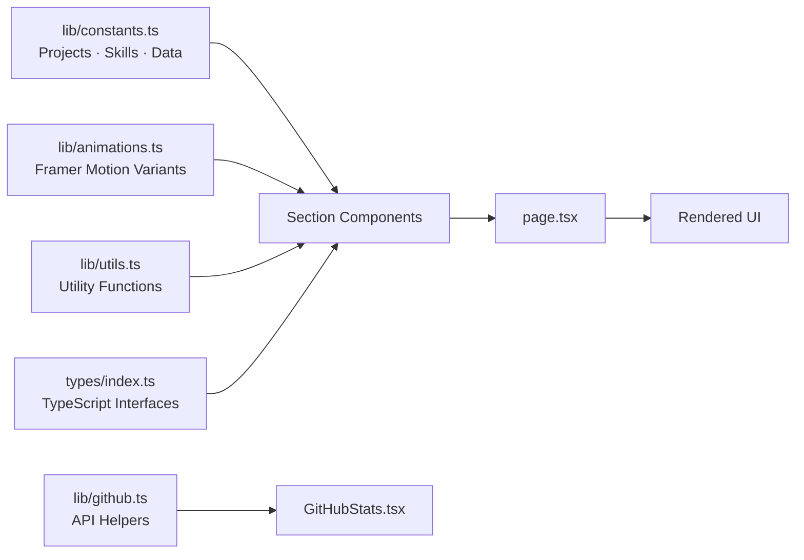
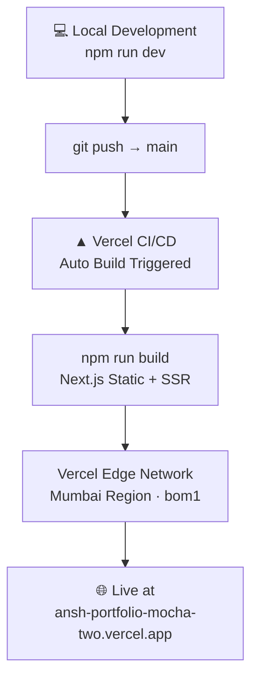
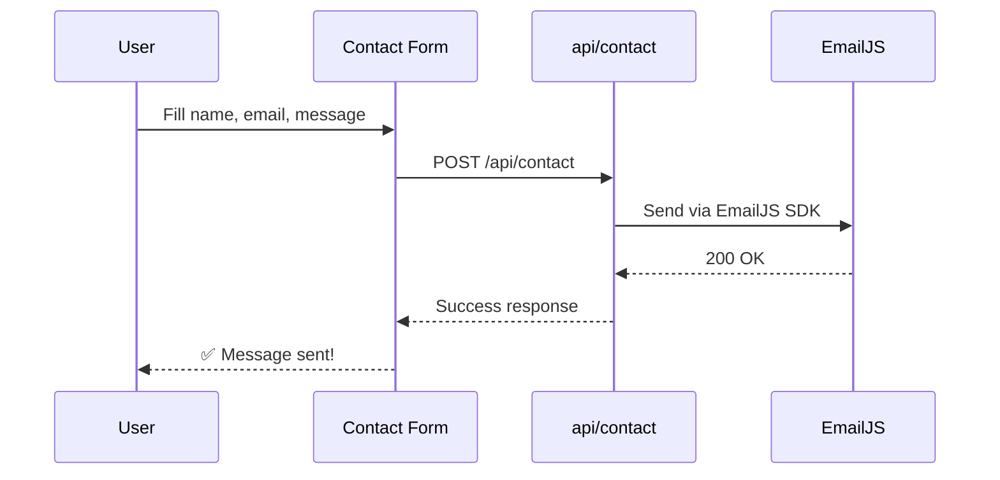

<div align="center">

# ⚡ Ansh Tripathi — Portfolio

### AI/ML Engineer & Full Stack Developer

*A futuristic, animated, production-grade portfolio built with Next.js 14, Framer Motion, and TailwindCSS — designed to leave a lasting impression.*

[](https://ansh-portfolio-mocha-two.vercel.app/)
[](https://nextjs.org/)
[](https://www.typescriptlang.org/)
[](https://tailwindcss.com/)
[](https://vercel.com/)
[](./LICENSE)

</div>

---

## 🌐 Live Portfolio

> **[🚀 https://ansh-portfolio-mocha-two.vercel.app/](https://ansh-portfolio-mocha-two.vercel.app/)**

Deployed on Vercel with Mumbai region (`bom1`) for ultra-low latency. Auto-deploys on every push to `main`.

---

## ✨ Features

| Feature | Description |
|---|---|
| 🎨 Neural Dark Design | Custom design system with electric cyan `#00F5FF` + deep violet `#7C3AED` |
| 🌗 Dark / Light Mode | Seamless theme toggle via `next-themes` |
| 🧠 Particle Field | Canvas 2D neural network topology animation |
| 🖱️ Cursor Trail | Custom animated cursor (desktop only) |
| 📊 Live GitHub Stats | Real-time GitHub data via proxied API (1hr cache) |
| ✍️ Typewriter / Terminal | Animated text effects with `TerminalText` + `AnimatedText` |
| 🧲 Magnetic Buttons | Physics-based hover interactions |
| 📜 Scroll Progress | Top-of-page reading progress indicator |
| 🃏 Glow Cards | Glassmorphism cards with radial glow on hover |
| 📱 Fully Responsive | Mobile-first, optimized for all screen sizes |
| ♿ Accessible | `prefers-reduced-motion` respected throughout |
| ⚡ Optimized | Dynamic imports, transform-only animations, cached APIs |

---

## 🛠️ Tech Stack

| Layer | Technology |
|---|---|
| Framework | Next.js 14 (App Router) |
| Language | TypeScript 5 |
| Styling | TailwindCSS v3 + CSS custom properties |
| Animations | Framer Motion + CSS keyframes |
| Particles | Canvas 2D API |
| Theming | next-themes |
| Icons | Lucide React + React Icons |
| Fonts | Syne, DM Sans, JetBrains Mono, Outfit |
| Email | EmailJS (serverless contact form) |
| Deployment | Vercel (Mumbai region) |
| Version Control | GitHub |

---

## 🏗️ Architecture

### Project Architecture



### Component Data Flow



### Deployment Flow



### Contact Form Flow



---

## 📁 Project Structure

```
Portfolio/
├── app/
│   ├── api/
│   │   ├── contact/        # EmailJS contact form handler
│   │   └── github/         # GitHub stats proxy (1hr cache)
│   ├── globals.css          # Design system CSS variables
│   ├── layout.tsx           # Root layout + metadata + JSON-LD
│   └── page.tsx             # Main page orchestrator
│
├── components/
│   ├── layout/
│   │   ├── Navbar.tsx
│   │   ├── Footer.tsx
│   │   └── ThemeToggle.tsx
│   ├── sections/
│   │   ├── Hero.tsx
│   │   ├── About.tsx
│   │   ├── Skills.tsx
│   │   ├── Projects.tsx
│   │   ├── Experience.tsx
│   │   ├── Achievements.tsx
│   │   ├── Certifications.tsx
│   │   ├── GitHubStats.tsx
│   │   ├── Resume.tsx
│   │   └── Contact.tsx
│   ├── ui/
│   │   ├── ParticleField.tsx   # Neural network canvas animation
│   │   ├── CursorTrail.tsx     # Custom animated cursor
│   │   ├── GlowCard.tsx        # Glassmorphism hover card
│   │   ├── MagneticButton.tsx  # Physics-based button
│   │   ├── AnimatedText.tsx    # Typewriter effect
│   │   ├── TerminalText.tsx    # Terminal-style text
│   │   ├── ScrollProgress.tsx  # Reading progress bar
│   │   ├── SectionReveal.tsx   # Scroll-triggered reveal
│   │   ├── CounterAnim.tsx     # Animated number counter
│   │   ├── LoadingScreen.tsx   # Initial loading screen
│   │   └── ScrollToTop.tsx     # Back-to-top button
│   └── providers/
│       ├── ThemeProvider.tsx
│       ├── MotionProvider.tsx
│       └── ClientShell.tsx
│
├── lib/
│   ├── constants.ts        # All data: projects, skills, experience
│   ├── animations.ts       # Shared Framer Motion variants
│   ├── github.ts           # GitHub API helpers
│   └── utils.ts            # Utility functions
│
├── types/
│   └── index.ts            # TypeScript interfaces
│
├── public/
│   ├── images/
│   │   ├── og-image.jpg    # Open Graph image (1200×630)
│   │   └── Logo.png
│   └── resume/
│       └── Ansh_Tripathi_Resume.pdf
│
├── .env.local              # Environment variables (not committed)
├── next.config.js
├── tailwind.config.ts
├── tsconfig.json
└── vercel.json             # Vercel deployment config
```

---

## 🚀 Getting Started

### Prerequisites

- Node.js `>= 18.x`
- npm `>= 9.x`

### 1. Clone the Repository

```bash
git clone https://github.com/AnshTripathi-dev/portfolio.git
cd portfolio
```

### 2. Install Dependencies

```bash
npm install
```

### 3. Configure Environment Variables

Create a `.env.local` file in the root:

```env
# EmailJS — Contact Form
EMAILJS_SERVICE_ID=your_service_id
EMAILJS_TEMPLATE_ID=your_template_id
EMAILJS_PRIVATE_KEY=your_private_key
```

**Setting up EmailJS:**
1. Create a free account at [emailjs.com](https://emailjs.com)
2. Create an Email Service (Gmail recommended)
3. Create a template with variables: `{{from_name}}`, `{{from_email}}`, `{{subject}}`, `{{message}}`
4. Copy your Service ID, Template ID, and Private Key into `.env.local`

### 4. Run Development Server

```bash
npm run dev
```

Open [http://localhost:3000](http://localhost:3000) — hot reload is enabled automatically.

### 5. Production Build

```bash
npm run build   # Compile and optimize
npm start       # Start production server
```

---

## 🎨 Design System

The **Neural Dark** design system is defined via CSS custom properties in `globals.css`:

| Token | Value | Usage |
|---|---|---|
| `--color-primary` | `#00F5FF` | Electric cyan accent |
| `--color-secondary` | `#7C3AED` | Deep violet accent |
| `--color-bg` | `#050508` | Near-black background |
| Glassmorphism | `rgba(255,255,255,0.04)` + `backdrop-blur` | Card surfaces |

---

## ⚡ Performance

- Dynamic import for `ParticleField` — no SSR overhead
- GitHub API response cached for 1 hour via Next.js `fetch` cache
- All animations use only `transform` + `opacity` — no layout thrashing
- `prefers-reduced-motion` media query respected globally
- Custom cursor and particle effects disabled on touch/mobile devices

---

## 📄 Assets

| Asset | Path |
|---|---|
| Resume PDF | `public/resume/Ansh_Tripathi_Resume.pdf` |
| Open Graph Image | `public/images/og-image.jpg` (1200×630) |
| Logo | `public/images/Logo.png` |

---

## 📬 Contact

<div align="center">

| Platform | Link |
|---|---|
| 🌐 Portfolio | [ansh-portfolio-mocha-two.vercel.app](https://ansh-portfolio-mocha-two.vercel.app/) |
| 🐙 GitHub | [github.com/AnshTripathi-dev](https://github.com/AnshTripathi-dev) |
| 💼 LinkedIn | [linkedin.com/in/anshtripathi](https://linkedin.com/in/anshtripathi) |
| 📧 Email | Available via the contact form on the portfolio |

</div>

---

## 📝 License

This project is licensed under the **MIT License** — see the [LICENSE](./LICENSE) file for details.
Open source — feel free to fork, customize, and build your own version.

---

<div align="center">

Built with 💙 by **Ansh Tripathi** · 2026

*If this project helped or inspired you, consider giving it a ⭐*

</div>
